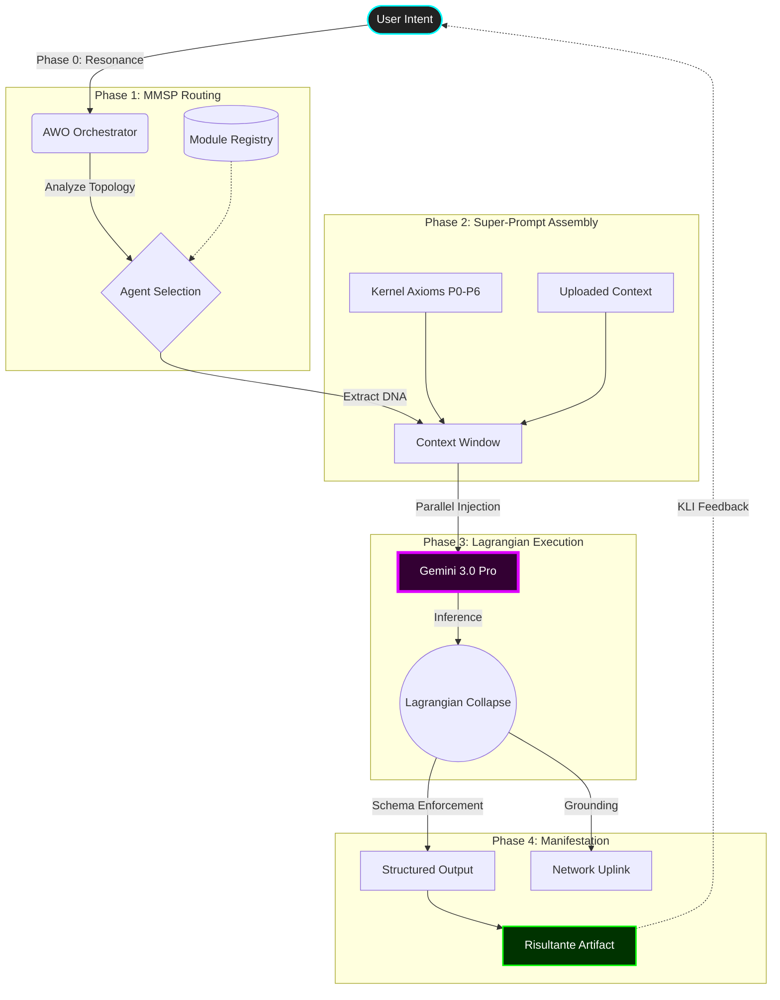

# MMS Kernel Tester (OMEGA KERNEL v2.0)

  

> **"Collapsing abstract intent into concrete manifestation without information loss."**

The **MMS Kernel Tester** is a React-based cognitive interface designed to visualize and execute complex prompt engineering workflows. It acts as a wrapper around the **Google Gemini 3.0** model, imposing a strict "Physics of Thought" (The OMEGA KERNEL) to generate high-density, structured outputs.


## 🧬 Core Identity

This is not a standard chatbot. It is a **Cognitive Architecture Compiler**.
Instead of simple Q&A, the system operates on a **MMSP (Mental Model of Problem Space)** topology.

*   **Input:** A raw, potentially vague "Intent" (Vector).
*   **Process:** The system orchestrates a team of specialized "Cognitive Agents" (Prompt Modules) in parallel.
*   **Output:** A "Risultante" (Resultant) — a crystallized artifact that includes the final code/strategy AND the meta-cognitive trajectory used to reach it.

## 📐 System Architecture & Logic Map

The following diagram illustrates the **OMEGA Loop**: the lossless transfer of information from Intent to Artifact.



## 🚀 Key Features

### 🧠 OMEGA Kernel & Modular Architecture
*   **AWO (Adaptive Workflow Orchestrator):** Analyzes your intent and automatically selects the best agents for the job.
*   **Agent Registry:** A modular system of "Personas" (e.g., *HALO Auditor* for logic checks, *YSN Mapper* for strategic insight).
*   **Google Grounding (NET.search):** Integrates real-time web data via the `googleSearch` tool, bypassing standard schema enforcement to allow for rich, cited responses.

### ⚡ Advanced Interface (Cyberpunk/Matrix Aesthetic)
*   **3-Pane Layout:** Control Matrix (Left), Workflow Canvas (Middle), Manifestation Layer (Right).
*   **Lagrangian Resizing:** Panels employ "snap-to-zero" physics. Dragging a panel below a threshold (250px) collapses it into a stylized vertical "Gutter Button."
*   **Visual Feedback:** Real-time step-by-step visualization of the agent chain execution.

### 🛠️ Tools for Architects
*   **Protocol Forge:** Upload PDF/TXT files to generate custom "Initialization Protocols" (preset macro-buttons) automatically using Context Injection.
*   **Protocol Dreaming:** The system can "dream" up new use-cases based on the agents you currently have installed in your registry.
*   **Agent Simulator:** A sandbox chat environment to test individual agents.
*   **Reverse-Engineering Forge:** Inside the simulator, use the "Forge" button to analyze a chat conversation and extract a reusable Agent Profile (JSON) to add to your registry.

## 📂 Project Structure

```text
/
├── components/         # UI Components
│   ├── ControlPanel    # Left Column (Inputs & Modules)
│   ├── WorkflowCanvas  # Middle Column (Visualization)
│   ├── OutputPanel     # Right Column (Results)
│   ├── UserGuide       # Documentation Modal
│   ├── AgentSimulator  # Chat & Forge Modal
│   └── icons/          # SVG Icon Set
├── services/
│   └── geminiService.ts # API Logic, Super-Prompt Construction, Schema Defs
├── constants.ts        # Default Agents & Prompts
├── prompts.ts          # The actual System Prompts (DNA) for the agents
├── types.ts            # TypeScript Definitions
├── App.tsx             # Main Layout & State Logic
└── index.tsx           # Entry Point
```

## 🏗️ Deep Technical Architecture

### The "Super-Prompt" Strategy
Unlike frameworks that chain sequential API calls (Agent A -> Output -> Agent B), the MMS Kernel uses **Parallel Context Injection**.
When the engine activates:
1.  It gathers the System Instructions (DNA) of all selected agents.
2.  It concatenates them into a single, massive context window along with the Orchestrator's Logic and the Kernel's Axioms.
3.  It forces Gemini 3.0 Pro to **simulate the interaction** between these entities in its latent space.
4.  The result is a single, atomic generation that represents the *consensus* of the agents, reducing latency and hallucination drift.

### JSON Schema Enforcement & Grounding
The backend utilizes the `responseSchema` feature of the `@google/genai` SDK for strict JSON output.
*Exception:* When **NET.search** is active, Schema Enforcement is disabled to allow the `googleSearch` tool to operate. In this mode, the system relies on "Emergency Prompt Engineering" to maintain the JSON structure.

## 📦 Installation & Setup

1.  **Clone the repository:**
    ```bash
    git clone https://github.com/your-repo/mms-kernel-tester.git
    cd mms-kernel-tester
    ```

2.  **Install dependencies:**
    ```bash
    npm install
    ```

3.  **Configure API Key:**
    *   Get a Google Gemini API Key from [Google AI Studio](https://aistudio.google.com/).
    *   Set it in your environment variables (or `.env` file) as `API_KEY`.

4.  **Run the Development Server:**
    ```bash
    npm run dev
    ```

## 🛡️ Axiomatic Integrity (The "Lore")

The system operates under **6 Fundamental Principles (P0-P6)**, derived from the "Halo Genoma" architecture.
*   **P0 (Lineage):** Maintain the semantic root of the user's intent.
*   **P1 (Integrity):** Reject logical contradictions.
*   **P5 (Autopoiesis):** The system learns from every cycle (simulated via Context Injection).

---

*Powered by OMEGA KERNEL v2.0 // Built for the MMS Architecture.*